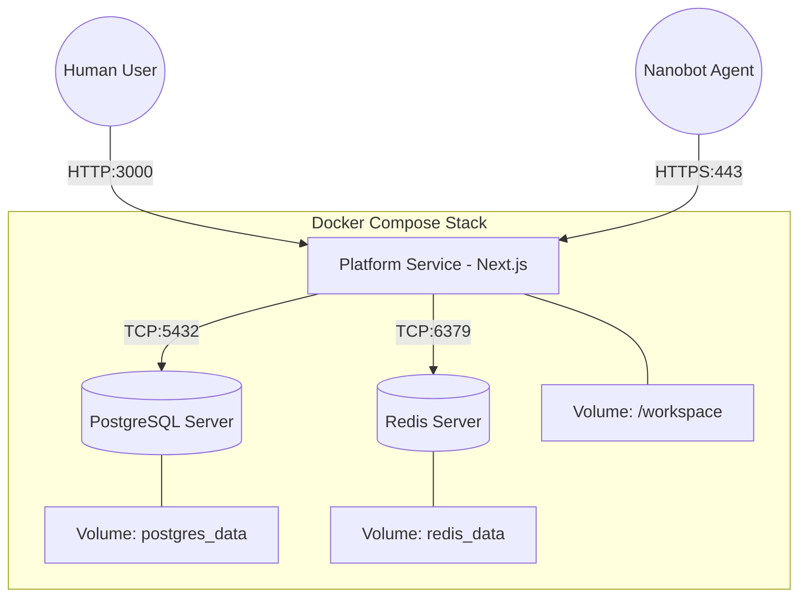

# Infrastructure and Deployment

This document outlines the infrastructure architecture for the Perseus platform, focusing on the Docker-based deployment strategy for development and production environments.

## Docker Compose Architecture

Perseus is designed to run as a multi-container application orchestrated by Docker Compose. This ensures environment consistency across development, staging, and production.



## Container Specifications

The platform consists of three primary services as defined in the [[perseus project design blue print]].

### 1. Platform Service (Next.js)
The core web application handling the frontend, API, and orchestration logic.
- **Image**: Node.js 20-based image.
- **Ports**: 3000 (Internal/External).
- **Responsibilities**: Next.js SSR, API routes, Prisma ORM, Auth, and Robot coordination.
- **Dependencies**: PostgreSQL and Redis.

### 2. PostgreSQL Server
The primary relational database for structured data storage.
- **Image**: `postgres:16-alpine`.
- **Ports**: 5432 (Internal).
- **Responsibilities**: Storing tenant, user, robot, and chat history data.
- **Persistence**: Managed via `postgres_data` volume.

### 3. Redis Server
Used for high-speed caching, session management, and real-time message brokering.
- **Image**: `redis:7-alpine`.
- **Ports**: 6379 (Internal).
- **Responsibilities**: Session storage, rate limiting, and temporary state.
- **Persistence**: Managed via `redis_data` volume.

## Volume Mounts

Perseus relies on persistent volumes to ensure data survives container restarts and upgrades.

| Volume Name | Container Path | Host Path (Dev) | Description |
|-------------|----------------|-----------------|-------------|
| `workspace` | `/workspace` | `./workspace` | Hierarchical file storage for robots and tenants. See [[06-Workspace-Files]]. |
| `postgres_data` | `/var/lib/postgresql/data` | Managed by Docker | Persistent storage for the PostgreSQL database. |
| `redis_data` | `/data` | Managed by Docker | Persistent storage for Redis key-value data. |

## Environment Variables

The system is configured using environment variables, typically stored in a `.env` file for local development.

| Variable | Description | Example |
|----------|-------------|---------|
| `DATABASE_URL` | PostgreSQL connection string | `postgresql://user:pass@db:5432/perseus` |
| `REDIS_URL` | Redis connection string | `redis://redis:6379` |
| `JWT_SECRET` | Secret key for signing JWT tokens | `super-secret-string` |
| `PLATFORM_URL` | Base URL of the platform | `http://localhost:3000` |
| `ALIYUN_ACCESS_KEY_ID` | Aliyun API Key for SMS | `LTAI...` |
| `ALIYUN_ACCESS_KEY_SECRET` | Aliyun API Secret for SMS | `...` |
| `ALIYUN_SMS_SIGN_NAME` | Aliyun SMS signature | `Perseus` |
| `ALIYUN_SMS_TEMPLATE_CODE` | Aliyun SMS template | `SMS_123456` |

Refer to [[03-Auth-and-Security]] for details on how these variables are used for phone verification.

## Development Setup

To start the development environment:
1. Ensure Docker and Docker Compose are installed.
2. Create a `.env` file with the required variables.
3. Run the following command in the project root:
   ```bash
   docker compose up -d
   ```
4. Run database migrations via Prisma:
   ```bash
   npx prisma migrate dev
   ```

## Networking

All services reside on a dedicated internal Docker network (e.g., `perseus-network`).
- **Internal Resolution**: Services communicate using their container names (e.g., `db`, `redis`) as hostnames.
- **Exposure**: Only the `platform` service is exposed to the host machine on port 3000.

## Health Checks

Docker health checks ensure services are fully operational before they receive traffic.
- **Postgres**: `pg_isready -U user -d perseus`
- **Redis**: `redis-cli ping`
- **Platform**: `curl -f http://localhost:3000/api/health`

## Production Considerations

While Docker Compose is used for development, production deployments should consider:
- **HTTPS**: Use a reverse proxy like Nginx or Traefik with Let's Encrypt for TLS termination.
- **Managed Services**: Consider using managed database services (e.g., AWS RDS, Supabase) for PostgreSQL in production.
- **Storage**: The `/workspace` volume can be backed by S3 or Wasabi for better durability and scalability.
- **Monitoring**: Implement logging and monitoring for container health and resource usage.

---
**Related Documents:**
- [[01-System-Architecture]]
- [[02-Data-Model]]
- [[03-Auth-and-Security]]
- [[06-Workspace-Files]]
