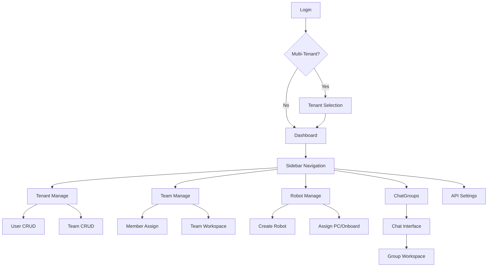

# User Journeys & Wireframes

This document outlines how users interact with the Perseus platform and provides visual concepts for the interface.

## User Personas

The platform serves four primary roles, each with distinct permissions and goals.

### Tenant Owner
The ultimate authority for a tenant. They manage billing, high-level configuration, and can promote others to admins.
- **Goals**: Scale robot workforce, manage organizational structure.
- **Key Actions**: Create tenant, grant admin roles, manage all resources.

### Admin
The operational manager of the tenant.
- **Goals**: Keep the system running smoothly, onboard teams and robots.
- **Key Actions**: Full control over users, teams, and robots, except for granting the admin role itself.

### Regular User
A team member who uses robots to get work done.
- **Goals**: Efficient task delegation and collaboration.
- **Key Actions**: Manage team resources, create chatgroups, assign tasks to robots.

### Robot (System Actor)
An autonomous agent (nanobot) that performs tasks.
- **Goals**: Execute commands and report results.
- **Key Actions**: Listen for tasks, use tools, chat with humans, access workspace files.

## Key User Journeys

### 1. Sign Up & Onboard
A new user joins the platform and sets up their organization.
1. User visits the landing page and enters their phone number.
2. User receives a verification code via Aliyun SMS.
3. After verification, user chooses to create a new tenant.
4. User enters organization details and becomes the Tenant Owner.

### 2. Create Team
An owner or admin organizes people and robots into a functional unit.
1. User navigates to the Tenant Manage page.
2. User clicks "Add Team" and provides a name.
3. User assigns initial human members and robots to the team.
4. A default chatgroup is automatically created for the team.

### 3. Create Robot
Defining a new AI assistant on the platform.
1. User navigates to the Robot Manage page.
2. User clicks "Create Robot".
3. User defines the robot name and uploads its `soul.md` (defining its personality and behavior).
4. Robot is saved in the tenant's registry.

### 4. Robot Onboarding (Assign PC)
Connecting the virtual robot entity to a physical nanobot service.
1. User selects a robot and clicks "Assign a PC".
2. Platform generates a JWT `robot-token` containing identity and permission data.
3. User copies the token and the platform base URL.
4. User starts the nanobot service on a local machine, inputting the token and URL.
5. Nanobot calls the platform API to fetch secrets (OpenAI/Anthropic keys) and reports its online status.

### 5. Create ChatGroup
Setting up a collaboration space.
1. User clicks the "New Group" button in the chat panel.
2. User selects members from their team (must include at least 2 humans or 1 human and 1 robot).
3. User gives the group a name.
4. The group appears in the recent list for all members.

### 6. Assign Task (@mention)
Delegating work to a robot.
1. User opens a chatgroup containing a robot.
2. User types `@` in the edit window, triggering a member search popup.
3. User selects the robot and types a command (e.g., "Generate a python script for X").
4. The platform routes this message to the specific nanobot.
5. Robot processes the task and posts the result back to the chat.

### 7. Share Files
Managing documents within the workspace hierarchy.
1. User navigates to the Workspace browser.
2. User uploads a file to a specific level: Tenant, Team, or ChatGroup.
3. Permission flows downward: Tenant files are visible to all teams; team files are visible to all groups in that team.
4. Users and robots can reference these files by path or link in the chat.

### 8. Manage API Keys
Setting up credentials for external integrations.
1. Admin or Owner navigates to the API settings.
2. User generates a new API key.
3. Tenant-level keys are reserved for admins; user-level keys are available to all.
4. User uses the key to programmatically interact with platform endpoints.

## Wireframe Concepts

### Login & Tenant Select
```
+------------------------------------------+
|                 PERSEUS                  |
|                                          |
|       [ Phone: +86 138.... ]             |
|       [ Code:  6 5 4 3 2 1 ]             |
|                                          |
|              [ LOGIN ]                   |
|                                          |
|------------------------------------------|
|                                          |
|          Select Organization             |
|                                          |
|   (o) Acme Corp (Owner)                  |
|   ( ) Stark Ind (Admin)                  |
|                                          |
|          [ Enter Tenant ]                |
+------------------------------------------+
```

### Dashboard Overview
```
+-------+----------------------------------+
| LOGO  | Dashboard                        |
|-------|----------------------------------|
| Side  | Status: Online [5] Idle [2]      |
| Nav   |                                  |
|       | Active Teams: [ Engineering ]    |
| Tenan |               [ Marketing   ]    |
| Teams |                                  |
| Robot | Recent Activity:                 |
| Chat  | - Robot 'Alpha' finished Task #42|
| API   | - User 'Marco' joined 'Dev Sync' |
|       |                                  |
+-------+----------------------------------+
```

### Management Views
**Tenant Manage**
```
+------------------------------------------+
| Users | Teams | Robots | Settings        |
|------------------------------------------|
| [Search Users...]        [ + Add User ]  |
|                                          |
| Name       Role      Team       Action   |
| Marco      Owner     Core       [Edit]   |
| Robot1     Robot     Core       [PC]     |
+------------------------------------------+
```

**Team Manage**
```
+------------------------------------------+
| Team: Core Engineering                   |
|------------------------------------------|
| Members:                 Shared Files:   |
| - Marco (Human)          - design.pdf    |
| - Jane (Human)           - api.yaml      |
| - Robot1 (Robot)         - logs/         |
|                                          |
| [ + Assign Member ]      [ Upload File ] |
+------------------------------------------+
```

**Robot Manage**
```
+------------------------------------------+
| All Robots | Active | Offline            |
|------------------------------------------|
| Name       Status     Team      Action   |
| Alpha      Online     Core      [Config] |
| Beta       Offline    Support   [Assign] |
|                                          |
| [ + Create New Robot ]                   |
+------------------------------------------+

Assign PC for 'Beta':
+------------------------------------------+
| 1. Copy Token: [ eyJhbGciOiJIUzI1... ]   |
| 2. Base URL:   [ https://api.per... ]    |
|                                          |
| [ Generate New Token ]    [ Done ]       |
+------------------------------------------+
```

### ChatGroup Interface (60/40 Split)
```
+---------+--------------------------------+
| Groups  | Group: #Feature-Dev            |
|---------+--------------------------------|
| Search  |                                |
|         | User A: How is the API?        |
| > Dev   | Robot X: Ready to test.        |
| > Gen   | User B: @RobotX check logs.    |
| > Sync  |                                |
|         |        (History 60%)           |
|---------+--------------------------------|
|         |                                |
|         | @R                             |
|         | +--------------------+         |
|         | | Robot X (Core)     |         |
|         | | Robot Y (Support)  |         |
|         | +--------------------+         |
|         |        (Editor 40%)            |
+---------+--------------------------------+
```

### Workspace Browser
```
+------------------------------------------+
| Workspace / AcmeCorp / Core / #Dev       |
|------------------------------------------|
| [..] Parent Directory                    |
| [D] configs/                             |
| [F] architecture.png                     |
| [F] roadmap.md                           |
|                                          |
| [ Upload ] [ New Folder ] [ Download All]|
+------------------------------------------+
```

## Navigation Structure

The platform uses a hierarchical navigation model reflecting the [[04-Platform-Entities]] structure.



## Related Documentation
- [[00-Perseus-Overview]]: Platform vision and core concepts.
- [[05-Chat-System]]: Technical details of the messaging backend.
- [[07-Robot-Lifecycle]]: From creation to active service.
- [[06-Workspace-Files]]: Detailed file permission and storage logic.
