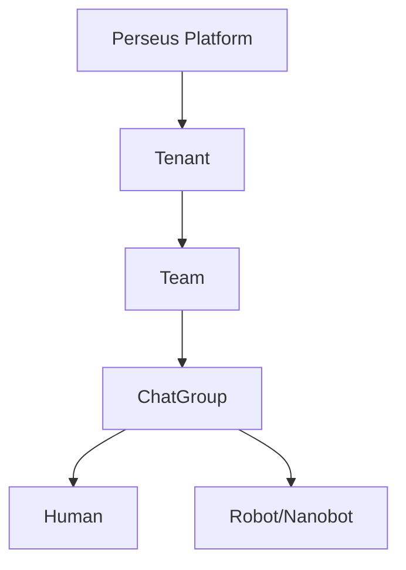
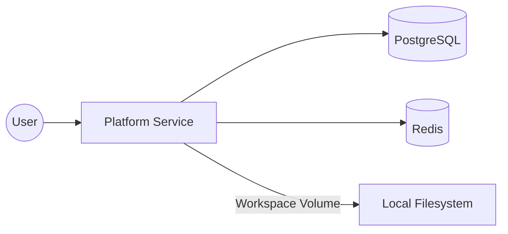

> [!abstract] TL;DR
> Perseus is a multi-tenant web platform for managing AI robot agents (nanobots). Built on Next.js and PostgreSQL, it provides team-based chatgroups where humans can assign tasks to robots via @mentions, share files through a hierarchical workspace, and monitor robot work progress in real-time.

## Vision

Perseus aims to bridge the gap between human management and AI agent execution. By providing a centralized platform, it enables users to orchestrate complex workflows using "nanobots"—AI agents that operate on real computers with the capability to listen, speak, and act using various tools. The platform serves as the command center for these agents, offering real-time communication, file sharing, and comprehensive management of tenants, teams, and users.

## Core Hierarchy

The platform follows a strict hierarchical structure to ensure data isolation and clear management boundaries.

## Key Concepts

### What is the Platform?
The platform is the central web application where users manage robots, teams, and tenants. It provides the UI for chat-based task assignment, workspace file management, and monitoring of robot activities.

### What is a Robot (Nanobot)?
> [!info] Robot Definition
> A robot is a nanobot AI agent running on a real computer. It functions like a digital employee with:
> - **Ears**: Ability to listen for tasks and commands from the platform.
> - **Mouth**: Ability to chat and respond to users on the platform.
> - **Hands**: Ability to execute actions by using tools, mcps .

### What is a Team?
A team is the fundamental unit of collaboration. It contains humans and robots who work together. Each team has at least one chatgroup on the platform where members can communicate and share files. A team must have at least two members, and cannot consist solely of robots.

### What is a ChatGroup?
A chatgroup is the primary interface for interaction. It features a dual-panel layout:
- **Navigation Panel**: A list of recently used groups.
- **Chat Body**: Split into a viewing area (60% height) and an editing window (40% height).
Users use the `@mention` system to assign tasks to specific robots within the chat.

### What is a Workspace?
A workspace provides hierarchical file sharing across three levels. Permissions and files are inherited downwards:
1. **Tenant Level**: Files accessible to all teams and groups within the tenant.
2. **Team Level**: Files accessible to all groups within the specific team.
3. **ChatGroup Level**: Files specific to a single chatgroup.

Inheritance rule: `Tenant Files > Team Files > ChatGroup Files`.

## Tech Stack

| Component | Technology | Purpose |
|-----------|-----------|---------|
| Frontend | Next.js, React, Tailwind CSS | Modern, responsive UI and server-side rendering |
| Backend | Node.js (Next.js API Routes) | Server-side logic and API implementation |
| Database | PostgreSQL | Relational data storage for entities and chat history |
| ORM | Prisma | Type-safe database access and migrations |
| Infrastructure | Docker Compose | Containerized development and deployment environment |
| Cache/Session | Redis | Fast session management and real-time state |

## Docker Architecture

The platform runs in a containerized environment using Docker Compose to ensure consistency across development and production.

## Related Documents

| Document | Description |
|----------|-------------|
| [[01-System-Architecture]] | System architecture and component design |
| [[02-Data-Model]] | Database schema with Prisma models |
| [[03-Auth-and-Security]] | Multi-tenant auth, RBAC, API keys |
| [[04-Platform-Entities]] | Entity specs: Tenant, Team, ChatGroup, Human, Robot |
| [[05-Chat-System]] | Chat UI, @mention system, messaging |
| [[06-Workspace-Files]] | File management, permission inheritance |
| [[07-Robot-Lifecycle]] | Robot creation, JWT token, onboarding |
| [[08-API-Design]] | RESTful API endpoints |
| [[09-MCP-Integration]] | MCP server design for nanobot |
| [[10-Infrastructure]] | Docker Compose setup |
| [[11-User-Journeys]] | User flows and wireframes |

## Success Metrics

Perseus measures success through the following key performance indicators:
- **Robot Uptime**: Percentage of time robots are successfully connected to the platform.
- **Task Completion Rate**: Ratio of successfully executed robot tasks to total assigned tasks.
- **User Adoption**: Number of active tenants and teams created on the platform.
- **System Latency**: Response time for @mentions and chat message delivery.
