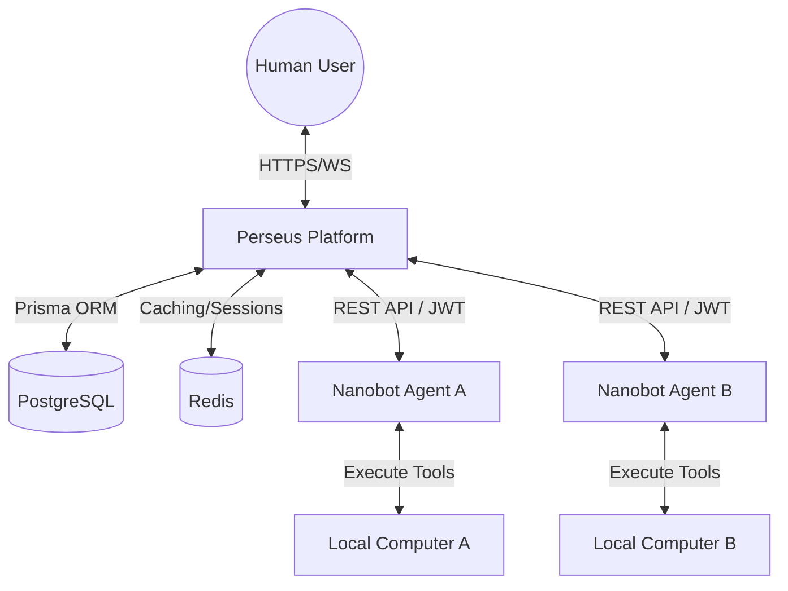
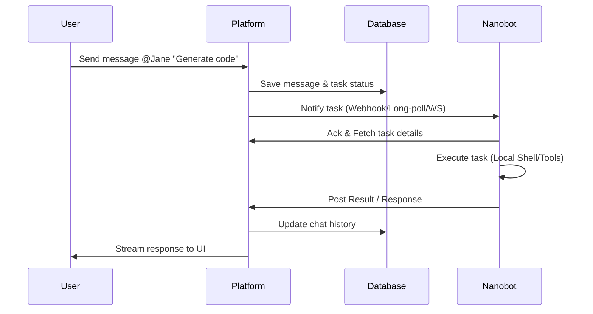
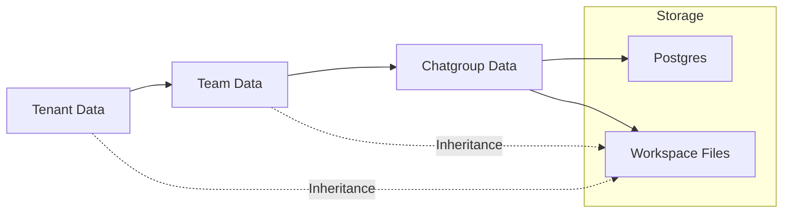

# System Architecture

This document describes the high-level architecture of the Perseus platform, including its components, communication patterns, and technology stack. Perseus is designed as a multi-tenant platform to manage and orchestrate AI agents (nanobots) across different teams and chatgroups.

> [!info] Vision
> To provide a seamless, secure, and scalable interface between human managers and distributed AI agents, enabling complex task automation through a chat-based collaborative environment.

## System Overview

Perseus follows a modern web architecture with a centralized platform service and distributed client agents.

## Component Architecture

The system is composed of several key modules that interact to provide the full Perseus experience.

### 1. Platform Service (Next.js)
The core of the system, handling:
- **Frontend**: A React-based dashboard for managing tenants, teams, robots, and real-time chat.
- **Backend API**: Node.js API routes serving both the web UI and external nanobot agents.
- **Authentication**: Multi-tenant auth with Role-Based Access Control (RBAC).

### 2. Distributed Nanobots (Clients)
Lightweight Python agents running on remote machines.
- Connect to the platform using a long-lived `robot-token` (JWT).
- Expose platform functionality via an internal MCP (Model Context Protocol) server.
- Execute actions on the host machine (shell, filesystem) based on tasks received.

### 3. Data Tier
- **PostgreSQL**: Stores relational data including tenant hierarchies, user profiles, robot metadata, and chat history. See [[02-Data-Model]] for details.
- **Redis**: Handles real-time message brokering, session storage, and rate limiting.
- **Workspace**: A hierarchical file storage system mapped to the local filesystem or future S3-compatible storage.

## Communication Patterns

Perseus utilizes several communication protocols to ensure responsiveness and security.

### Request-Response (REST)
Used for standard operations like onboarding, configuration retrieval, and history management. Nanobots call Platform APIs using standard HTTP methods.

### Real-time Messaging
WebSockets (via Next.js/Socket.io or similar) are used for live chat updates, status indicators, and immediate task notification.

### Sequential Flow
The diagram below illustrates a typical task assignment flow.

## Data Flow Diagrams

The following diagram shows how data moves between the tenant levels.

## Technology Decisions

The stack was chosen to balance developer velocity, type safety, and operational reliability.

| Technology | Role | Justification |
|------------|------|---------------|
| **Next.js** | Framework | Supports SSR/ISR for performance and integrated API routes for a unified codebase. |
| **PostgreSQL** | Database | Robust support for relational multi-tenant schemas and complex queries. |
| **Prisma** | ORM | Provides type-safe database access, reducing runtime errors and simplifying migrations. |
| **Redis** | Cache/Broker | High-performance key-value store essential for real-time features and session management. |
| **Tailwind CSS**| Styling | Enables rapid UI development with a consistent, utility-first approach. |

## Security Architecture

Security is central to the Perseus design, especially given the remote execution capabilities of nanobots.

- **Multi-tenancy**: Hard isolation at the database level to ensure data cannot leak between tenants.
- **Robot Authentication**: Nanobots use a JWT `robot-token` which encodes identity and permission scope.
- **RBAC**: Built-in roles (Owner, Admin, User) control access to sensitive management functions.
- **Sandboxing**: Workspace access for robots is restricted to the context where they are invoked.

For more details, see [[03-Auth-and-Security]].

## Scalability Considerations

- **Stateless APIs**: The Platform service is designed to be stateless, allowing horizontal scaling behind a load balancer.
- **Database Indexing**: Optimized for tenant-scoped queries to maintain performance as the data grows.
- **Infrastructure**: Deployment via Docker Compose ensures consistency across environments. See [[10-Infrastructure]] for setup.

---
**Related Documents:**
- [[00-Perseus-Overview]]
- [[02-Data-Model]]
- [[03-Auth-and-Security]]
- [[10-Infrastructure]]
