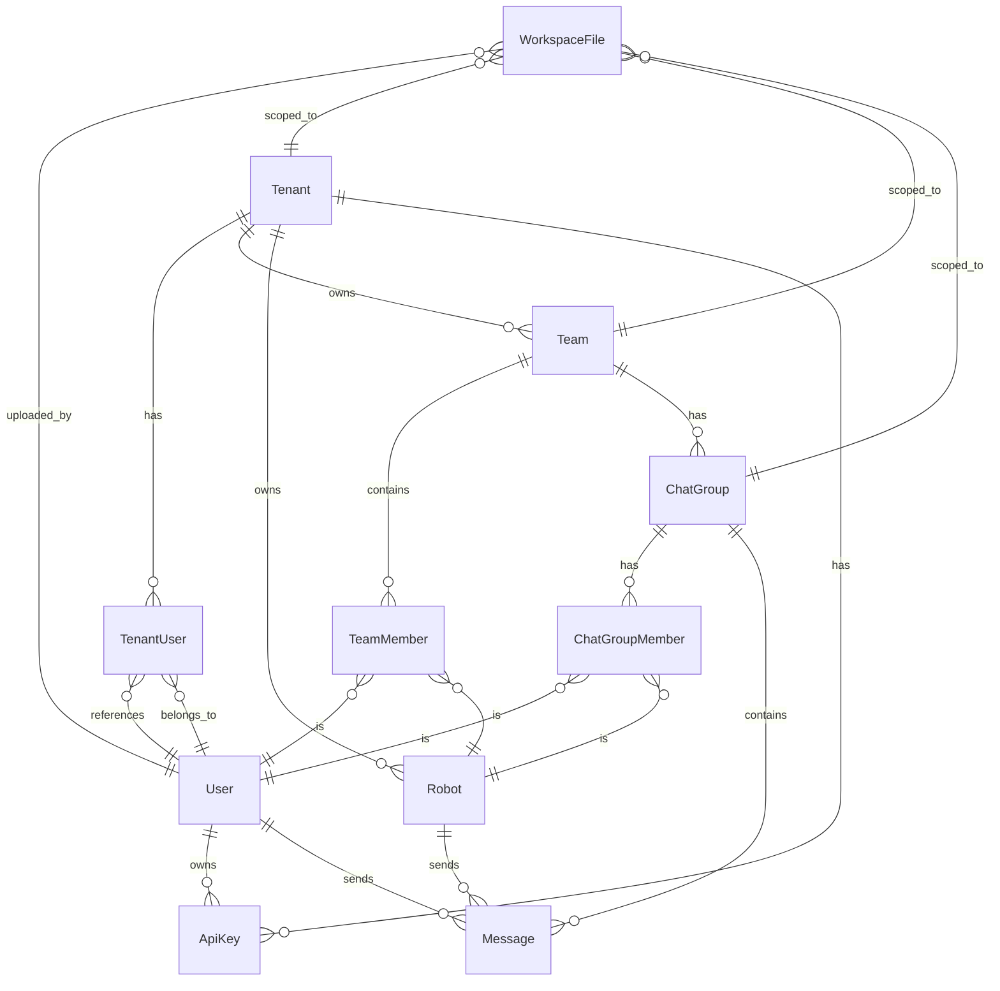

# Data Model & Database Schema

This document outlines the database architecture for the Perseus platform. We use PostgreSQL as the primary relational database, with Prisma as our Object-Relational Mapping (ORM) tool. The schema is designed for multi-tenant isolation and efficient robot-human collaboration.

> [!abstract] Core Philosophy
> The data model prioritizes strong consistency and strict multi-tenant isolation. Every organizational unit belongs to a Tenant. Access control is enforced at the database level using a shared-schema, row-filtering approach.

## Entity Relationship Diagram

The following diagram illustrates the relationships between core entities.



## Core Models

These definitions follow Prisma schema conventions. They provide a blueprint for our database tables and their relationships.

### Identity & Access

```prisma
model Tenant {
  id        String   @id @default(uuid())
  name      String
  slug      String   @unique
  ownerId   String
  createdAt DateTime @default(now())
  updatedAt DateTime @updatedAt

  users     TenantUser[]
  teams     Team[]
  robots    Robot[]
  apiKeys   ApiKey[]
  files     WorkspaceFile[]
}

model User {
  id        String   @id @default(uuid())
  email     String   @unique
  phone     String?  @unique
  name      String
  createdAt DateTime @default(now())

  tenants   TenantUser[]
  apiKeys   ApiKey[]
  messages  Message[]
}

model TenantUser {
  userId    String
  tenantId  String
  role      String   // owner, admin, user
  joinedAt  DateTime @default(now())

  user      User     @relation(fields: [userId], references: [id])
  tenant    Tenant   @relation(fields: [tenantId], references: [id])

  @@id([userId, tenantId])
}
```

### Organizations & Teams

```prisma
model Team {
  id        String   @id @default(uuid())
  name      String
  tenantId  String
  createdAt DateTime @default(now())

  tenant    Tenant   @relation(fields: [tenantId], references: [id])
  members   TeamMember[]
  groups    ChatGroup[]
  files     WorkspaceFile[]
}

model TeamMember {
  teamId     String
  memberId   String
  memberType String   // human, robot
  joinedAt   DateTime @default(now())

  team       Team     @relation(fields: [teamId], references: [id])

  @@id([teamId, memberId])
}
```

### Robots & Intelligence

```prisma
model Robot {
  id             String   @id @default(uuid())
  name           String
  tenantId       String
  createdById    String
  soulMd         String
  status         String   // created, onboarding, onboard, offline
  tokenHash      String?
  tokenExpiresAt DateTime?

  tenant         Tenant   @relation(fields: [tenantId], references: [id])
}
```

### Communication & Collaboration

```prisma
model ChatGroup {
  id          String   @id @default(uuid())
  name        String
  teamId      String
  createdById String
  createdAt   DateTime @default(now())

  team        Team     @relation(fields: [teamId], references: [id])
  members     ChatGroupMember[]
  messages    Message[]
  files       WorkspaceFile[]
}

model ChatGroupMember {
  chatGroupId String
  memberId    String
  memberType  String   // human, robot
  joinedAt    DateTime @default(now())

  group       ChatGroup @relation(fields: [chatGroupId], references: [id])

  @@id([chatGroupId, memberId])
}

model Message {
  id          String   @id @default(uuid())
  chatGroupId String
  senderId    String
  senderType  String   // human, robot
  content     String
  mentions    Json?    // Array of @mentions
  createdAt   DateTime @default(now())
  updatedAt   DateTime @updatedAt

  group       ChatGroup @relation(fields: [chatGroupId], references: [id])
}
```

### Files & API Security

```prisma
model WorkspaceFile {
  id           String   @id @default(uuid())
  path         String
  filename     String
  mimeType     String
  size         BigInt
  uploadedById String
  scope        String   // tenant, team, chatgroup
  scopeId      String
  createdAt    DateTime @default(now())

  tenant       Tenant?   @relation(fields: [scopeId], references: [id], map: "scope_tenant")
  team         Team?     @relation(fields: [scopeId], references: [id], map: "scope_team")
  chatGroup    ChatGroup? @relation(fields: [scopeId], references: [id], map: "scope_chatgroup")
}

model ApiKey {
  id        String   @id @default(uuid())
  keyHash   String   @unique
  label     String
  level     String   // tenant, user
  tenantId  String?
  userId    String?
  createdAt DateTime @default(now())
  expiresAt DateTime?

  tenant    Tenant?  @relation(fields: [tenantId], references: [id])
  user      User?    @relation(fields: [userId], references: [id])
}
```

## Multi-Tenant Isolation Strategy

We implement a shared-database, shared-schema architecture with logical isolation. Security is maintained through strict row-level filtering.

### Row-Level Isolation
Every table containing organization-specific data includes a `tenantId` column. Our application middleware injects this ID into every query. This ensures that users can only see or modify data belonging to their active tenant session.

### Access Control
Access is managed by the `TenantUser` relation. When a user logs in, they select a tenant context. The platform verifies their role (owner, admin, or user) before authorizing operations. Robots are strictly bound to a single tenant. They can only access resources within chatgroups where they are members.

## Migration Strategy

Our database schema evolves using the Prisma Migrate workflow. This approach guarantees that our local development environments and production servers remain in sync.

1. **Schema Definition**: Developers update the `schema.prisma` file to reflect model changes.
2. **Migration Creation**: The `npx prisma migrate dev` command generates a timestamped SQL migration file.
3. **Validation**: We review the generated SQL to ensure it aligns with performance and integrity requirements.
4. **Deployment**: Production updates occur during CI/CD pipelines using `npx prisma migrate deploy`.

## Related Documents

- [[00-Perseus-Overview]]: Platform vision and core concepts.
- [[01-System-Architecture]]: High-level component interactions.
- [[04-Platform-Entities]]: Business rules and entity lifecycles.
- [[08-API-Design]]: Endpoint specifications and data formats.
