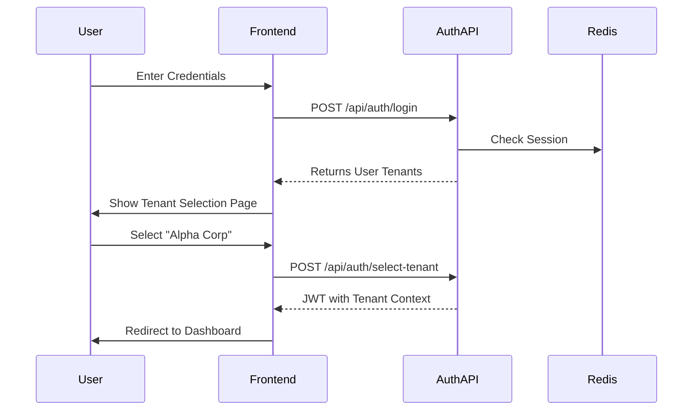
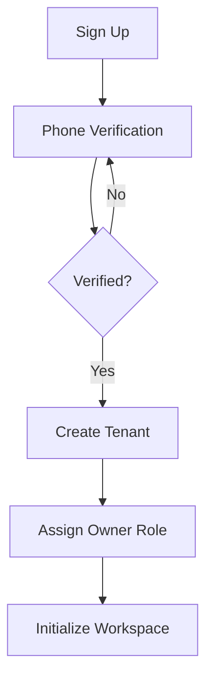

# Authentication & Security

The Perseus platform uses a multi-tenant authentication system designed for human users and AI robot agents. Security depends on strict tenant isolation, role-based access control, and specialized tokens for robot communication.

> [!abstract] Key Security Principles
> - **Isolation**: Every request must be authenticated and scoped to a specific tenant.
> - **Identity**: Humans use phone-verified accounts. Robots use cryptographically signed JWTs.
> - **Least Privilege**: Users and robots only access resources within their assigned teams and chatgroups.

## Authentication Flow

### User Registration and Login
Initial onboarding requires phone number verification using Aliyun SMS. This process ensures accountability for tenant owners.

1. **Sign-up**: The user provides an email and phone number.
2. **Verification**: Aliyun SMS sends a code to the mobile device.
3. **Completion**: After verification, the user can create a new tenant or join an existing one.

### Multi-Tenant Login
Because one email address can own or participate in many tenants, the login process includes a tenant selection stage.

## Role-Based Access Control (RBAC)

Access management uses a built-in roles system. Roles are assigned per tenant. This means a user can be an owner in one tenant and a regular user in another.

| Role | Permissions | Scope |
| :--- | :--- | :--- |
| **Owner** | Full control over the tenant, billing, and all resources. | Tenant-wide |
| **Admin** | Manage teams, robots, and users. Cannot grant the admin role to others. | Tenant-wide |
| **User** | Access and manage resources only within their assigned teams. | Team-specific |

## Onboarding Flow

New users follow a structured process to establish a tenant.

> [!info] Onboarding Requirement
> A user becomes a Tenant Owner automatically when they create a new tenant after phone verification.

## API Key System

The platform provides two levels of API keys for programmatic access. These are separate from the specialized robot tokens.

### Tenant-Level Keys
Only owners or admins can create these keys. They allow tenant-wide automation and management. These keys grant access to all teams and resources within the tenant.

### User-Level Keys
All users can create these keys. They serve as personal credentials for individual developer tasks. Access is restricted to the specific user's permissions and team memberships.

## Robot Token (JWT)

Robots do not use standard login credentials. They authenticate using a specialized Robot Token created during the "Assign a PC" process.

### Token Structure
The robot token is a JWT containing:
- `robotName`: The display name of the agent.
- `creatorId`: The ID of the human who created the robot.
- `tenantId`: The tenant the robot belongs to.
- `teamIds`: Array of teams the robot can join.

> [!important] Token Expiry
> Robot tokens do not expire by default. This ensures continuous operation. Users can set an optional expiration date during generation if they need higher security.

## Session Management

The platform handles sessions with a hybrid approach. Redis stores session data for human users to support fast lookup and revocation. Stateless JWTs serve robots and API access, which helps the system scale across services.

## Security Headers and Middleware

The platform implements several measures to protect against common web vulnerabilities.
- **CORS**: Restricted to authorized platform domains and robot clients.
- **CSRF**: Protection on all state-changing API endpoints.
- **Rate Limiting**: Enforced at the user and tenant level to prevent abuse.
- **Middleware**: Every internal API route runs through isolation middleware. This middleware adds the `tenantId` to database queries automatically.

## Related Documents

| Document | Description |
| :--- | :--- |
| [[00-Perseus-Overview]] | High-level vision and project concepts. |
| [[02-Data-Model]] | Database schema including the roles and tokens tables. |
| [[07-Robot-Lifecycle]] | Detailed onboarding flow for AI agents. |
| [[08-API-Design]] | Endpoint specifications and authentication headers. |
