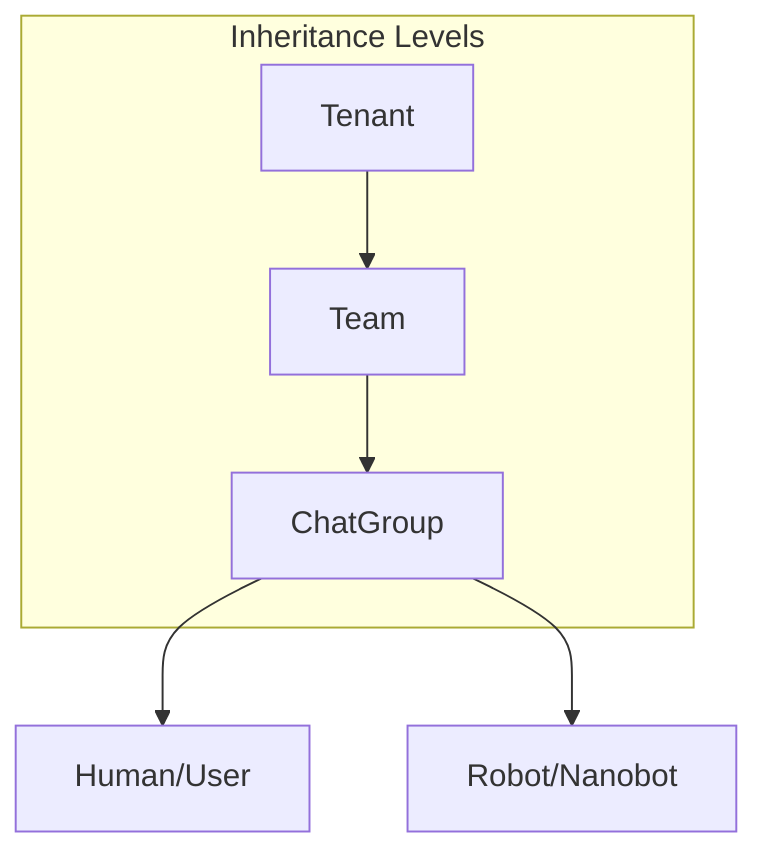
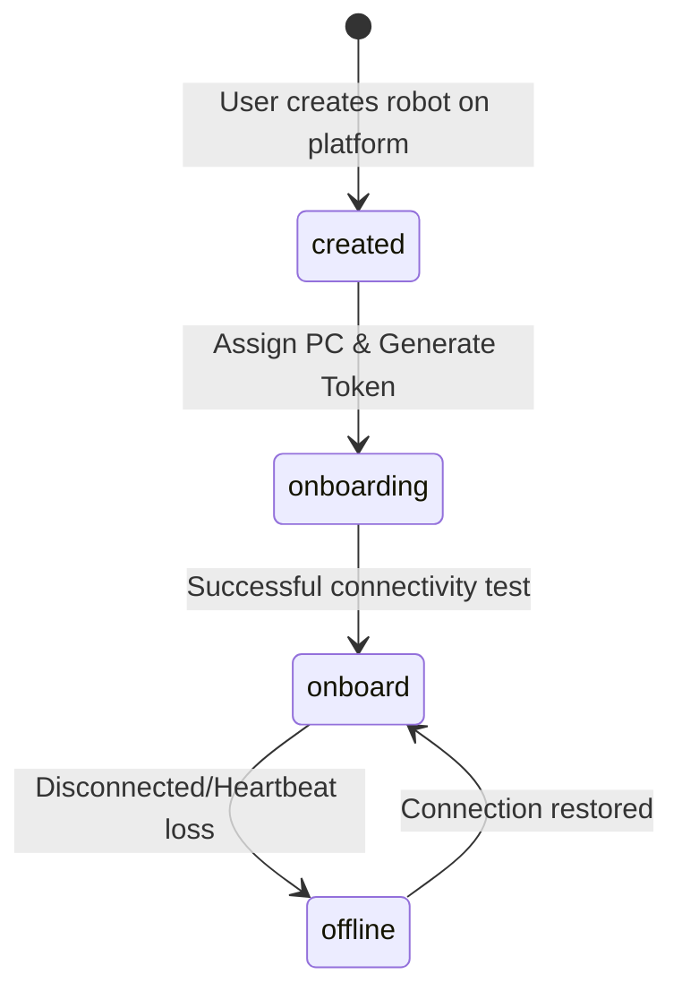

# Platform Entities

This document specifies the core entities within the Perseus platform, their relationships, and the business rules governing their behavior. For technical database implementation details, see [[02-Data-Model]].

## Entity Hierarchy

The following diagram illustrates the structural relationship between platform entities.

---

## Tenant

The **Tenant** is the top-level organizational unit. It provides strict data isolation and serves as the root for file inheritance.

### Description
A tenant represents a customer, organization, or isolated environment. All other entities (except platform-wide roles) belong to a specific tenant.

### Properties
- **Name**: Unique identifier for the organization.
- **Settings**: Configuration for workspace limits, authentication providers, and branding.

### Business Rules
- Tenants are completely isolated from one another.
- Files uploaded at the tenant level are accessible to all teams within that tenant (see [[06-Workspace-Files]]).

### Relationships
- Contains multiple [[Team]] entities.
- Root for the [[06-Workspace-Files|Workspace File Inheritance]].

### Management Operations
- Create/Delete Tenant.
- Manage Tenant Admins.
- Configure tenant-wide policies.

---

## Team

A **Team** is the primary functional unit where humans and robots collaborate.

### Description
Teams group together a set of users and robots to work on specific projects or functional areas.

### Properties
- **Name**: Descriptive name for the team.
- **Member List**: Collection of humans and robots assigned to the team.

### Business Rules
- A team is the minimal structure required to host robots and humans.
- Each team automatically has at least one default [[ChatGroup]] on the platform.

### Relationships
- Belongs to a [[Tenant]].
- Contains [[Human]] and [[Robot]] members.
- Owns multiple [[ChatGroup]] entities.

### Management Operations
- Add/Remove Human members.
- Assign/Unassign Robots.
- Create specialized ChatGroups.

---

## ChatGroup

A **ChatGroup** is the interactive space where communication and task assignment occur.

### Description
The interface for real-time collaboration. It provides a shared workspace and chat history for its members.

### Properties
- **Name**: (Optional) identifier for the group.
- **Type**: Default Team group or specialized sub-group.
- **Member List**: Subset of team members participating in the group.

### Business Rules
- **Minimum Membership**: A chatgroup must have at least 2 members.
- **Human Requirement**: Must contain at least 1 human.
- **Robot Constraint**: Groups consisting only of robots (e.g., 2 robots, no humans) are not allowed.

### Relationships
- Belongs to a [[Team]].
- Inherits files from [[Tenant]] and [[Team]] levels.

### Management Operations
- Send messages and files.
- Mention (@) robots to trigger [[05-Chat-System|Task Assignment]].
- Manage group membership.

---

## Human / User

A **Human** is a real-world operator with management and interaction capabilities.

### Description
Users who log into the platform to orchestrate robots, manage teams, and collaborate with other humans.

### Properties
- **Profile**: Name, email, avatar.
- **Roles**: Tenant Admin, Team Member, etc. (see [[03-Auth-and-Security]]).

### Business Rules
- Humans are responsible for defining robot "souls" and assigning them to hardware.
- Only humans can initiate the [[Robot]] onboarding process.

### Relationships
- Belong to a [[Tenant]].
- Members of multiple [[Team]]s and [[ChatGroup]]s.

### Management Operations
- Authentication and Profile management.
- Creation and configuration of [[Robot]] entities.
- Interaction via [[05-Chat-System|Chat]].

---

## Robot

A **Robot** is an AI agent (Nanobot) that executes tasks on external hardware.

### Description
An AI-driven entity capable of "listening" to chat commands, "speaking" responses, and "acting" via tools.

### State Machine
The robot follows a lifecycle from creation to operational status.

### Business Rules
- **Onboarding**: Requires a `soul.md` definition and a valid JWT robot-token for authentication.
- **Security**: The robot-token contains name, creator, tenant, and team info. It defaults to non-expiring but can be configured otherwise.
- **Operation**: Responds to `@mentions` within authorized [[ChatGroup]]s.

### Relationships
- Belongs to a [[Tenant]].
- Assigned to one or more [[Team]]s.
- Operates within [[ChatGroup]]s.

### Management Operations
- **Onboard**: Assign PC, generate token, and configure nanobot connectivity.
- **Configure**: Update `soul.md` or system instructions.
- **Monitor**: Check connectivity status and task progress.
