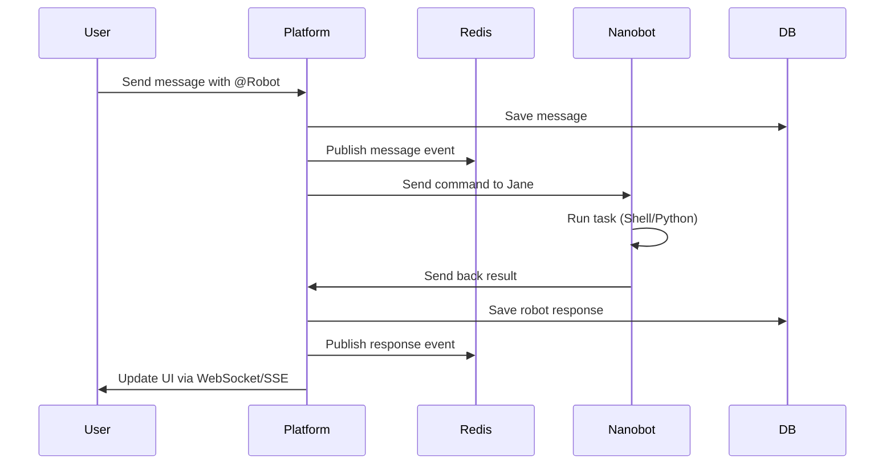
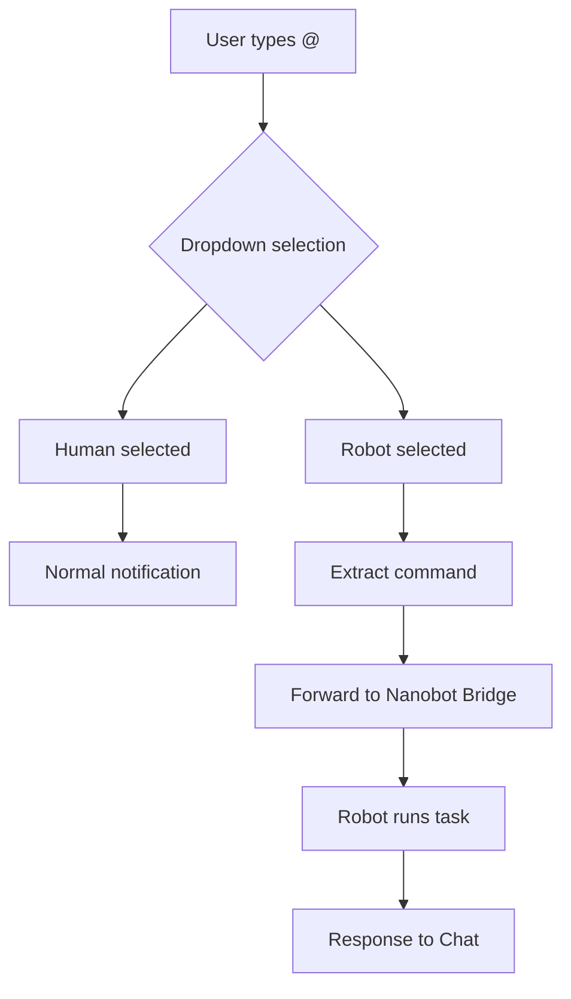

# Chat & Messaging Design

The chat system is the main bridge for humans and robots to talk within the [[00-Perseus-Overview|Perseus platform]]. It handles real-time talk, tasking via @mentions, and access to workspace files.

## Chat UI Layout

The chat UI uses a split-panel design to keep things focused. The left side handles group navigation. The right side is for the active talk.

```text
+----------------+--------------------------------------------------+
| Search Groups  | Chat Group Name: "Engineering"                   |
+----------------+--------------------------------------------------+
| [G] General    |                                                  |
| [G] Backend    |       Message viewing area (60% height)          |
| [G] DevOps     |                                                  |
|                |   - User: Hello @Jane, check status.             |
|                |   - Jane: [Robot] Working on it...               |
|                |                                                  |
+----------------+--------------------------------------------------+
|                |                                                  |
|                |       Message editing area (40% height)          |
|                |                                                  |
|                |   > @Jane Generate a python script               |
|                |   > [Dropdown: Jane (Robot), Mark (Human)]       |
|                |                                                  |
+----------------+--------------------------------------------------+
```

### Layout Breakdown
- **Left Panel**: Lists recent chat groups in the team.
- **Right Panel (Viewing)**: Takes 60% vertical space. It shows history and live updates.
- **Right Panel (Editing)**: Takes 40% vertical space. This gives room for long commands or code blocks.

## @Mention System

Mentions trigger robot actions or alert humans.

### Dropdown Logic
Typing `@` in the editor opens a dropdown. This list shows:
- Robots in the team.
- Human members in the team.

### Format
Mentions use the `@Name Command` style.
- **Example**: `@Jane Generate a python code to output a triangle in terminal`

The platform checks if the target is a robot or human. It then routes the message.

## Message Flow

When a user sends a message, the platform looks for robot tasks.



## @Mention Flow Detail



## Message Types

- **Text**: Markdown messages.
- **System**: Alerts about members or status changes.
- **Robot Command**: Messages with @mentions that start tasks.
- **Robot Response**: Results from robots, like logs or code blocks.
- **File Attachment**: Links to items in the [[03-Workspace-Files|Workspace]].

## Real-Time Messaging

The platform uses WebSockets or SSE plus Redis Pub/Sub for fast delivery.

- **WebSocket/SSE**: Keeps a live link for UI updates.
- **Redis Pub/Sub**: Spreads messages across server nodes. This ensures all users see messages, no matter which server they hit.

## Message Storage

- **Postgres (Prisma)**: Stores chat history and group data for the long term.
- **Redis**: Holds temporary data and handles pub/sub events.

## Chat Group Creation

Any team member can start a chat group. Rules include:
- **Min Members**: At least 2.
- **Constraint**: Groups can't be just robots. 1 human is required.
- **Scope**: Groups stay within their team.

Related: [[04-Robot-Management|Robot Management]], [[01-Database-Schema|Database Design]].
