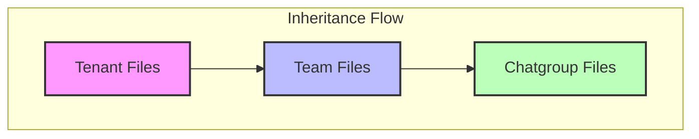

# Workspace & File Management

The Workspace is the central file sharing and management hub within the Perseus platform. It allows humans and robots to exchange documents, code, and data across different organizational levels.

## Workspace Concept

A Workspace represents a simple file sharing environment scoped to specific [[04-Platform-Entities]]. Every [[05-Chat-System|Chatgroup]], Team, and Tenant has an associated workspace area where files can be uploaded, stored, and retrieved.

## Permission Inheritance Model

Perseus uses a hierarchical permission model. Files uploaded at a broader level are automatically accessible to sub-entities. This ensures that organizational assets or team-wide resources are available where they are needed without duplicate uploads.



Access follows a "broadest to specific" flow:
1. **Tenant Files**: Accessible to all teams and chatgroups within the tenant.
2. **Team Files**: Accessible to all members and chatgroups within that specific team.
3. **Chatgroup Files**: Private to the members (human or robot) of that specific chatgroup.

## Storage Architecture

The platform's storage is designed for scalability and local performance.

* **Primary Volume**: All files are stored on a dedicated `/workspace` volume within the [[01-System-Architecture|Docker infrastructure]].
* **Physical Implementation**: Currently uses local filesystem storage mapped to the platform service.

> [!warning] Future Storage Interfaces
> While currently using a local volume, the platform architecture reserves interfaces for **S3** and **Wasabi** storage providers for future enterprise-grade scaling.

## Folder Structure

Files are organized systematically to prevent collision and enforce security at the filesystem level. The directory structure follows the platform hierarchy:

```text
/workspace/{tenantId}/{teamId}/{chatgroupId}/
```

* **Tenant Level**: `/workspace/{tenantId}/`
* **Team Level**: `/workspace/{tenantId}/{teamId}/`
* **Chatgroup Level**: `/workspace/{tenantId}/{teamId}/{chatgroupId}/`

## Robot File Access Rules

Security for AI agents is strictly enforced at the workspace level.

* **Contextual Access**: A robot can only access workspace files from the specific chatgroup where it was called.
* **Isolation**: Robots are prohibited from performing CRUD operations on files belonging to other chatgroups, even if they are members of the same team.
* **Credential Mapping**: The `robot-token` automatically maps the robot's requests to its authorized path.

## File Operations

The platform provides standard CRUD operations via the [[02-Data-Model|API interface]]:
* **Create**: Upload new files via the chat interface or API.
* **Read**: Retrieve file paths or download file contents.
* **Update**: Overwrite or version existing files.
* **Delete**: Remove files from the workspace.

## File Sharing in Chat

Inside the [[05-Chat-System|Chat Body]], users can send files directly to the workspace.
1. **Upload**: User attaches a file in the chat editing window.
2. **Path Resolution**: The platform saves the file to the correct folder and generates a relative path.
3. **Robot Notification**: If a robot is mentioned (@Robot) alongside a file, it receives the file path to perform its task (e.g., "Analyze this CSV").
4. **Download**: Any member of the group can click the file in the chat history to download it.
