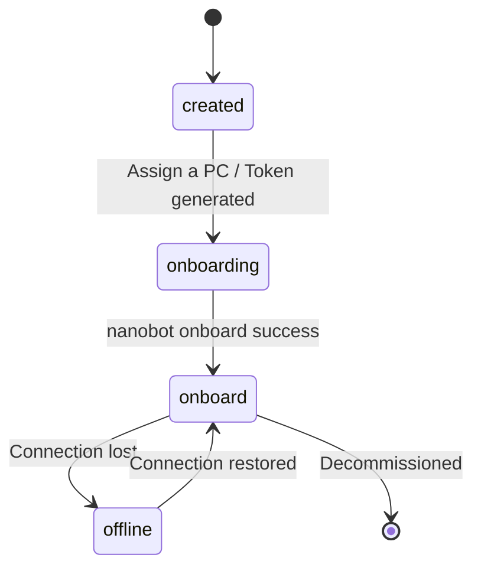
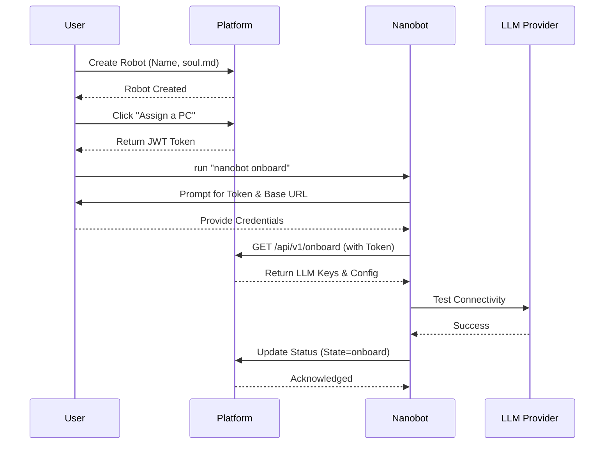

# Robot Lifecycle: Creation & Onboarding

This document outlines the lifecycle of a Robot within the Perseus platform, from its initial creation and personality definition to its onboarding and operational states.

## Robot Creation Flow

The lifecycle begins on the Perseus Platform. A user (typically a Tenant Owner or Admin) initiates the creation of a new Robot entity.

1. **Define Identity**: The user specifies a unique name for the robot.
2. **Define Personality (soul.md)**: The user provides the initial `soul.md` content, which defines the robot's personality, values, and traits.
3. **Team Assignment**: The robot is assigned to one or more teams within the tenant.
4. **Initial State**: Upon creation, the robot is in the `created` state.

## Robot Token Generation

To link a physical or virtual machine (PC) to the Robot entity on the platform, a secure credential is required.

- **Assign a PC**: In the Robot Management UI, the user clicks the "Assign a PC" button.
- **JWT Generation**: The platform generates a Robot Token. This is a JSON Web Token (JWT) containing:
    - Robot Name
    - Creator User ID
    - Belonging Teams
    - Tenant ID
- **Token Expiry**: By default, the token never expires, but the user can optionally set an expiration time.
- **Security**: This token is the primary credential for the Nanobot to communicate with the Platform.

## Nanobot Onboarding Flow

Once the token is generated, the user configures the local Nanobot instance.

1. **Initialization**: The user runs the `nanobot onboard` command on their machine.
2. **Configuration Input**:
    - **Robot Token**: The user pastes the JWT generated by the platform.
    - **Base URL**: The user sets the Platform API URL.
3. **Platform Sync**: The Nanobot calls the Platform API using the token to retrieve the full configuration:
    - LLM Provider settings (e.g., OpenAI/Anthropic base URLs and API keys).
    - Team-specific instructions.
4. **Verification**: The Nanobot performs a connectivity test to the platform and the LLM providers.
5. **Status Update**: If successful, the Nanobot notifies the platform, and the robot state transitions to `onboard`.

## Robot States

A Robot transitions through several states during its lifecycle.

| State | Description |
|-------|-------------|
| `created` | The Robot entity exists on the platform but has no associated Nanobot. |
| `onboarding` | A token has been generated, but the Nanobot has not yet completed setup. |
| `onboard` | The Nanobot is successfully connected and operational. |
| `offline` | The Nanobot was previously onboarded but is currently unreachable. |

## soul.md Design

The `soul.md` file is the "core" of the robot's personality. It is managed on the platform and synchronized to the Nanobot's workspace.

- **Purpose**: Defines how the robot interacts with users, its tone of voice, and its ethical boundaries.
- **Content**: Typically includes sections like `# Personality`, `# Values`, and `# Guidelines`.
- **Sync**: Updates to `soul.md` on the platform are pushed to the Nanobot (or pulled during sync) to ensure consistent behavior.

See `[[06-Workspace-Files]]` for details on how this file is structured in the local workspace.

## Token Management

Tokens are managed through the Robot Management UI.

- **Revocation**: If a PC is compromised or decommissioned, the token can be revoked on the platform, immediately disconnecting the Nanobot.
- **Re-assignment**: A robot can be re-assigned to a different PC by generating a new token.

## Robot Management UI

The Platform provides a centralized dashboard for managing all robots within a tenant.

- **Overview**: List of all robots with their current status (`onboard`, `offline`, etc.).
- **Configuration**: Edit robot names, `soul.md`, and team memberships.
- **Lifecycle Actions**: Generate tokens, revoke access, or delete robot entities.

## Nanobot Integration Points

The Nanobot communicates with the platform at several key points:

## Related Documents

- `[[00-Perseus-Overview]]`: High-level system goals.
- `[[01-System-Architecture]]`: Technical architecture overview.
- `[[04-Platform-Entities]]`: Definition of Robots and Tenants.
- `[[06-Workspace-Files]]`: Local file structure and `soul.md` details.
