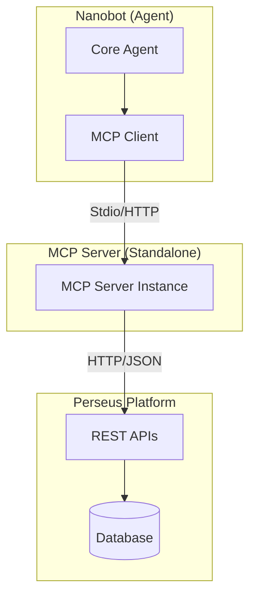

# MCP Integration

The Model Context Protocol (MCP) enables Perseus to expose platform capabilities to AI agents in a standardized way. This integration allows agents to interact with the platform using a unified tool interface.

## Architecture

The MCP integration follows a layered approach where a dedicated MCP server acts as a bridge between the Perseus Platform REST APIs and the MCP client.



The MCP server is a standalone process that translates MCP tool calls into platform API requests. It requires only the `platform_url` and a `robot-token` for [[03-Auth-and-Security|authentication]].

## MCP Server Design

The server is designed to be stateless and lightweight. It implements the MCP specification to provide:

- **Tool Discovery**: Exposes platform capabilities as discoverable tools.
- **Protocol Translation**: Maps MCP JSON-RPC calls to Platform REST endpoints.
- **Format Normalization**: Ensures platform responses are formatted correctly for LLM consumption.

### Transport

The integration supports two primary transport mechanisms:

1. **Stdio (Local)**: The default mode for local development or integrated deployments. Nanobot spawns the MCP server as a child process and communicates via standard input/output.
2. **HTTP/SSE (Remote)**: Used for distributed deployments where the MCP server runs as a separate web service.

## MCP Tools

The Perseus MCP server exposes the following core tools to provide full access to [[04-Platform-Entities|Platform Entities]].

| Tool Name | Description | Platform Endpoint Mapping |
|-----------|-------------|----------------------------|
| `send_message` | Sends a message to a specific chat group. | `POST /chat/messages` |
| `get_messages` | Retrieves conversation history from a group. | `GET /chat/groups/{id}/messages` |
| `list_chatgroups` | Lists all chat groups accessible to the robot. | `GET /chat/groups` |
| `upload_file` | Uploads a file to the workspace. | `POST /workspace/files` |
| `download_file` | Downloads a file from the workspace. | `GET /workspace/files/{id}/content` |
| `list_files` | Lists files available in the workspace. | `GET /workspace/files` |
| `get_task` | Retrieves details of a specific task. | `GET /tasks/{id}` |

Each tool handles its own parameter validation and maps directly to the corresponding platform API.

## Authentication

Authentication is handled via the `robot-token` provided during server initialization.

- The MCP server receives the token via environment variables or command-line arguments.
- It includes this token as a `Bearer` token in the `Authorization` header for all outgoing REST API calls to the Perseus Platform.
- Secure token handling ensures that the agent only accesses resources permitted by the robot's scope.

## Integration with Nanobot

Nanobot integrates with the MCP server by adding it to its configuration file as described in the [[01-System-Architecture|System Architecture]].

### Configuration Example

```json
{
  "tools": {
    "mcpServers": {
      "perseus": {
        "command": "python",
        "args": ["-m", "perseus_mcp_server"],
        "env": {
          "PLATFORM_URL": "https://api.perseus.ai",
          "ROBOT_TOKEN": "your-robot-token"
        }
      }
    }
  }
}
```

On startup, Nanobot connects to the MCP server, discovers the available tools, and registers them in its internal tool registry with the `mcp_perseus_` prefix. This allows the LLM to use platform features like [[05-Chat-System|Chat]] and [[06-Workspace-Files|File Management]] seamlessly.
